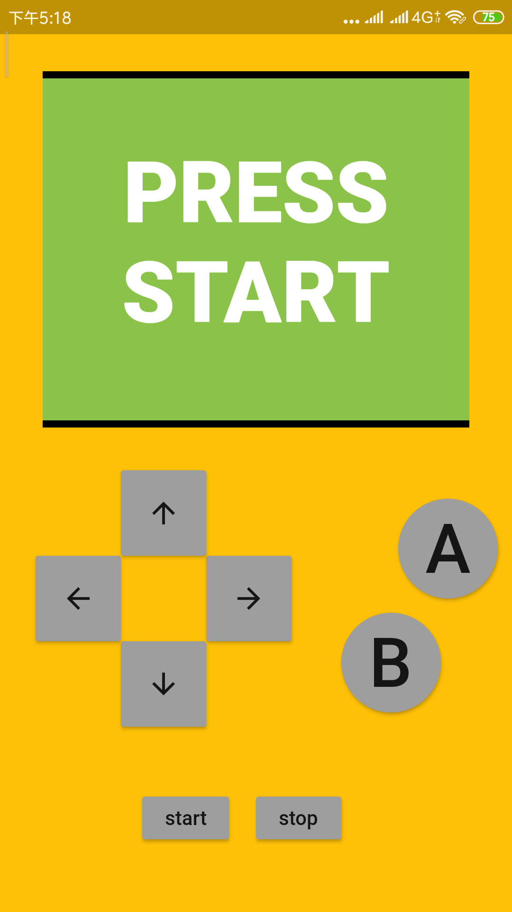
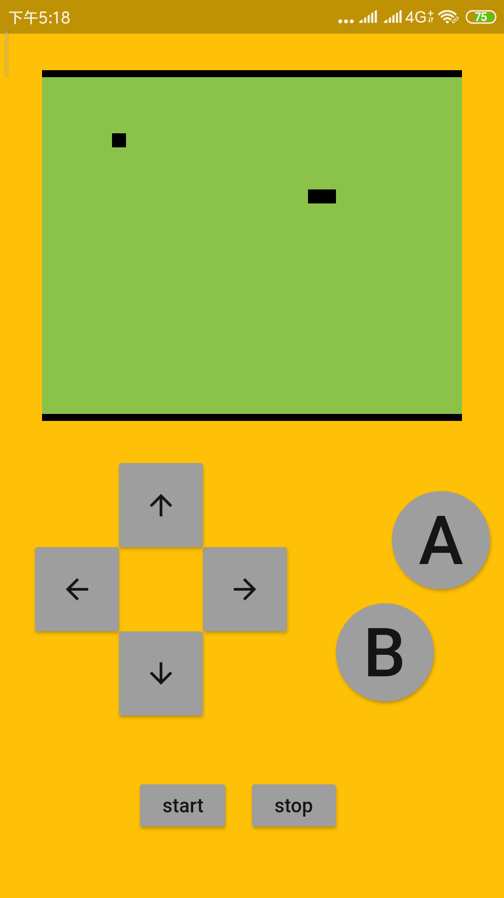
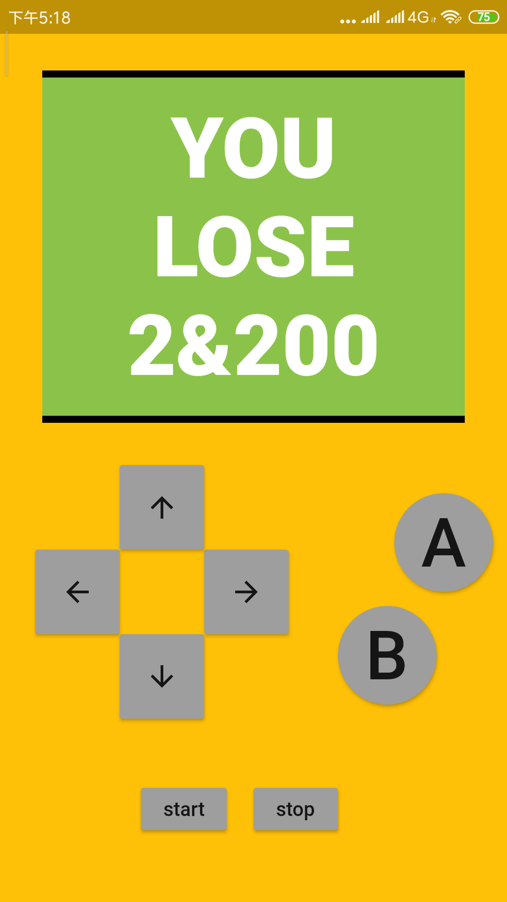

## Flutter Snake

&emsp;&emsp;初学flutter，还没学到网络相关部分但是又想做点东西练练手，就做了这个基于flutter的贪吃蛇小游戏。学得不精很多东西都没搞明白，比如事件通知之类的干脆直接用了全局事件总线……

&emsp;&emsp;上下左右控制方向，strat/stop控制开始暂停，AB控制速度

&emsp;&emsp;结束界面,&前是得分，&后是刷新时间，单位ms

<table>
    <tr>
        <td >

</td>
        <td >

</td>
        <td >

</td>
    </tr>
</table>
